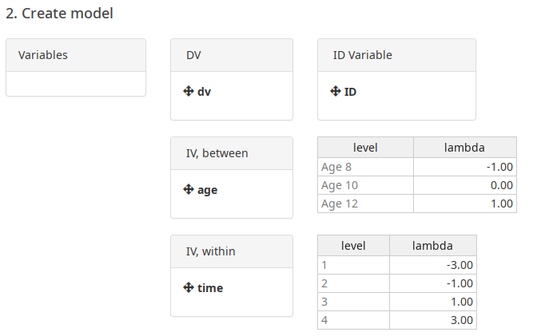
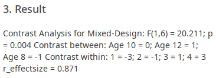

```{r, include = FALSE}
knitr::opts_chunk$set(
  collapse = TRUE,
  comment = "#>",
  fig.path = "man/figures/README-",
  out.width = "100%"
  
)

library(stringr)

clean_bib <- function(input_file, input_bib, output_bib){
  lines <- paste(readLines(input_file), collapse = "")
  entries <- unique(str_match_all(lines, "@([a-zA-Z0-9]+)[,\\. \\?\\!\\]]")[[1]][, 2])

  bib <- paste(readLines(input_bib), collapse = "\n")
  bib <- unlist(strsplit(bib, "\n@"))

  output <- sapply(entries, grep, bib, value = T)
  output <- paste("@", output, sep = "")

  writeLines(unlist(output), output_bib)
}

clean_bib("README.Rmd", "library.bib", "clean_library.bib")

```

# cofad

[](https://travis-ci.com/johannes-titz/cofad)
<!-- [](https://doi.org/10.21105/joss.02116) -->

<!-- To cite cofad in publications use: -->

<!-- Titz, J. (2020). cofad: A modern graphical user interface for 2-level mixed models. *Journal of Open Source Software, 5*(49), 2116. https://doi.org/10.21105/joss.02116 -->

<!-- A BibTeX entry for LaTeX users is -->

<!-- ``` -->
<!-- @article{titz2020, -->
<!--   title = {cofad: {A} modern graphical user interface for 2-level mixed models}, -->
<!--   author = {Titz, Johannes}, -->
<!--   year = {2020}, -->
<!--   journal = {Journal of Open Source Software}, -->
<!--   volume = {5}, -->
<!--   pages = {2116}, -->
<!--   doi = {10.21105/joss.02116}, -->
<!--   number = {49} -->
<!-- } -->
<!-- ``` -->

## Introduction

Cofad is an R package for conducting COntrast analysis in FActorial Designs like ANOVAs. If contrast analysis was to win a price it would be the one for the most underestimated, underused statistical technique. This is a pitty because in every case a contrast analysis is at least as good as an ANOVA, but in most cases it is actually better. To the question why, the simplest answer is that contrast analysis gets rid off the unspecific omnibus-hypothesis *there are differences somewhere* and substitutes it with a very specific numerical hypothesis. Furthermore, contrast analysis focuses on effects instead of significance. This is expressed doubly: First, there are three different effect sizes for contrast analysis: $r_\mathrm{effectsize}$, $r_\mathrm{contrast}$ and $r_\mathrm{alerting}$. Second, the effect size refers not to the data but to the tested hypothesis. The larger the effect, the more this speaks for the hypothesis. One can even compare different hypotheses against each other (hello experimentum crucis) by looking at the effect size for each hypothesis. 

If we sparked your interest we recommend to read some introductory literature like @furr2004,@rosenthal1985,@rosenthal2000, or, for the German-speaking audience, @sedlmeier2018. Contrast analysis is actually really easy to understand if you know what a correlation is. In this vignette we assume you know some basics about contrast analysis and want to use it for your own data. We will start with between-subjects designs and then show applications for within designs and mixed designs.

## Installation

Cofad has two components, the plain R-package and a shiny-app that offers a simple graphical user interface.

If you just want to use the cofad-app, you do not need to install it. Just go to www.cofad.titz.science and use it there. An example data file is loaded when you go to www.cofad.titz.science/example.

If you prefer the command line interface or want to use the cofad-app locally, install it from github (you need the package devtools for this):

```{r echo = T, results = "hide", eval = F}
# install.packages("devtools") # uncomment if you do not have devtools installed
devtools::install_github("johannes-titz/cofad")
```

Now can you load cofad and use it in your R-scripts.

You can also run the app:

```{r echo = T, results = "hide", eval = F}
cofad::run_app()
```

Yes, it is that easy---at least under GNU/Linux! 

If you have any problems installing cofad, check that your R version is up to date (currently `r version$version.string`). If you are using Windows, enable TLS 1.2 in the Internet Options Advanced tab (see https://github.com/r-lib/remotes/issues/130#issuecomment-423830669). Under Windows, you will also need Rtools to build the package: https://cran.r-project.org/bin/windows/Rtools/.

If it still does not work drop me an e-mail at johannes at titz.science or at johannes.titz at gmail.com.

## Using cofad

Before we start: Your data has to be in the long-format!

### Graphical-User-Interface

The graphical-user-interface is self-explanatory. Just load your data and drag the variables to the correct position. At the moment you can only read .sav (SPSS) and .csv files. 

As an example go to www.cofad.titz.science?example=rosenthal_tbl53 which will load a data set from @rosenthal2000 (Table 5.3). Nine children were  measured four times (within), but they also belong to different groups of age (between).

There are two hypotheses: 

1. linear increase over time (within)
($\lambda_\mathrm{1} = -3, \lambda_\mathrm{2} = -1, \lambda_\mathrm{3} = 1, \lambda_\mathrm{4} = 3$)
2. linear increase over age (between)
($\lambda_\mathrm{Age 8} = -1, \lambda_\mathrm{Age 10} = 0, \lambda_\mathrm{Age12} = 1$)

Now drag the variables to the correct position and set the lambdas accordingly:



The result should look like this:



A mixed design is ideal for testing out the cofad-app. You can now construct a separate within-model by removing the between variable "age". Then you can construct a separate between-model by removing "time" from within and only using "age" in between.

The graphical user interface will suffice for most users, but some will prefer to use the scripting capabilities of R. In the next sections we will look at several script examples for different designs.

### Between-Subjects Designs

Let us first load the package:

```{r setup}
library(cofad)
```

Now we need some data and hypotheses. We can simply take the data from @furr2004, where we have different empathy ratings of students from different majors. This data set is available in the cofad package:

```{r}
data("furr")
furr
```

Furr states three hypotheses:

  - Contrast A: Psychology majors have higher empathy scores than Education majors ($\lambda_\mathrm{psych} = 1, \lambda_\mathrm{edu} = -1$).
  - Contrast B: Business majors have higher empathy scores than Chemistry majors ($\lambda_\mathrm{bus} = 1, \lambda_\mathrm{chem} = -1$).
  - Contrast C: On average, Psychology and Education majors have higher empathy scores than Business and Chemistry majors ($\lambda_\mathrm{psych} = 1, \lambda_\mathrm{edu} = 1, \lambda_\mathrm{bus} = -1, \lambda_\mathrm{chem} = -1$).

These hypotheses are only mean comparisons, but this is a good way to start. Let's use cofad to conduct the contrast analysis:

```{r}
ca <- calc_contrast(dv = empathy, between = major,
                    lambda_between = c("psychology" = 1, "education" = -1,
                                       "business" = 0, "chemistry" = 0),
                    data = furr)
ca
```

The print method only shows some basic information, but we can use the summary method for more details:
```{r}
summary(ca)
```

From this table, $r_\mathrm{effectsize}$ is probably the most useful statistic. It is just the correlation between the lambdas and the dependent variable, which can also easily be calculated manually:

```{r}
lambdas <- rep(c(1, -1, 0, 0), each = 5)
cor(furr$empathy, lambdas)
```

The other two hypotheses can be tested accordingly:

```{r}
ca <- calc_contrast(dv = empathy, between = major,
                    lambda_between = c("psychology" = 0, "education" = 0,
                                       "business" = 1, "chemistry" = -1),
                    data = furr)
ca
ca <- calc_contrast(dv = empathy, between = major,
                    lambda_between = c("psychology" = 1, "education" = 1,
                                       "business" = -1, "chemistry" = -1),
                    data = furr)
ca
```

You will find that the numbers are identical to the ones presented in @furr2004. Now, imagine we have a more fun hypothesis and not just mean differences. From an elaborate theory we could derive that the means should be 73, 61, 51 and 38. We can test this with cofad directly because cofad will transfer the chosen lambdas into proper lambdas (the mean of the lambdas has to be 0):

```{r}
ca <- calc_contrast(dv = empathy, between = major,
                    lambda_between = c("psychology" = 73, "education" = 61,
                                       "business" = 51, "chemistry" = 38),
                    data = furr)
ca
```

The manual test shows the same effect size:

```{r}
lambdas <- rep(c(73, 61, 51, 38), each = 5)
cor(furr$empathy, lambdas)
```

Let us now do an analysis for within-subjects designs.

## Within-Subjects Designs

For within designs the calculations are quite different, but cofad takes care of it and we just have to use the within parameters *within* and *lambda_within* instead of the between equivalents. As an example we use Table 16.5 from @sedlmeier2018. Reading ability was assessed for eight participants under four different conditions. The hypothesis is that you can read best wihout music, white noise reduces your reading ability and music (independent of type) reduces it even further.

```{r}
data("sedlmeier537")
head(sedlmeier537)
calc_contrast(dv = reading_test, within = music,
              lambda_within = c("without music" = 1.25, 
                                "white noise" = 0.25,
                                "classic" = -0.75,
                                "jazz" = -0.75),
             ID = participant, data = sedlmeier537)
```

You can see that the siginifance test is just a $t$-test and the reported effect size is also for a mean comparison ($g$). (The $t$-test is one-tailed, because contrast analysis has always a specific hypotheses.) When conducting the analysis manually, we can see why:

```{r}
mtr <- matrix(sedlmeier537$reading_test, ncol = 4)
lambdas <- c(1.25, 0.25, -0.75, -0.75)
lc1 <- mtr %*% lambdas
t.test(lc1)
```

Only the linear combination of the dependent variable and the contrast weights for each participant is needed. With these values a normal $t$-test against 0 is conducted. While you can do this manually, using cofad is quicker and it also gives you more information such as the different effect sizes.

## Mixed Designs

The idea of mixed designs is a combination of between and within factors. In this case cofad calculates the *L*-Value for the within factor, which is treated as a new dependent variable. Thereafter, these values are used for the between analysis. We will again look at the example presented in @rosenthal2000 (see the section graphical-user-interface). Nine children were measured four times (within), but they also belong to different groups of age (between).

There are two hypotheses: 

1. linear increase over time (within)
($\lambda_\mathrm{1} = -3, \lambda_\mathrm{2} = -1, \lambda_\mathrm{3} = 1, \lambda_\mathrm{4} = 3$)
2. linear increase over age (between)
($\lambda_\mathrm{Age 8} = -1, \lambda_\mathrm{Age 10} = 0, \lambda_\mathrm{Age12} = 1$)

Let's have a look at the data and calculation:

```{r}
data("tab53")
head(tab53)
lambda_within <- c("1" = -3, "2" = -1, "3" = 1, "4" = 3)
lambda_between <-c("Age 8" = -1, "Age 10" = 0, "Age 12" = 1)

contr_mx <- calc_contrast(dv = dv, 
                          between = age,
                          lambda_between = lambda_between,
                          within = time,
                          lambda_within = lambda_within,
                          ID = ID, 
                          data = tab53
                          )
contr_mx
```

The results look like a contrast analysis for between-subject designs. Again, the summary gives some more details: The effect sizes and within group means and standard errors of the *L*-values.

```{r}
summary(contr_mx)
```

## Aggregated Data

Sometimes you would like to run a contrast analysis on aggregated data (e.g. when no raw data is available). If you have the means, standard deviations and sample sizes for every condition, you can do this in cofad. For instance, if we take our first example and aggregate it, we can still calculate the contrast analysis:

```{r}
library(dplyr)
furr_agg <- furr %>% group_by(major) %>% summarize(mean = mean(empathy),
                                             sd = sd(empathy), n = n())
lambdas = c("psychology" = 1, "education" = -1,
            "business" = 0, "chemistry" = 0)
calc_contrast_aggregated(mean, sd, n, major, lambdas, furr_agg)
```

And the result is indeed the same when compared to the analysis with the raw data:

```{r}
ca <- calc_contrast(dv = empathy, between = major,
                    lambda_between = c("psychology" = 1, "education" = -1,
                                       "business" = 0, "chemistry" = 0),
                    data = furr)
ca
```

Note that this will only work for between-subjects designs.

## Issues and Support
If you find any bugs, please use the issue tracker at:

https://github.com/johannes-titz/cofad/issues

If you need answers on how to use the package, drop me an e-mail at johannes at titz.science or johannes.titz at gmail.com

## Contributing

Comments and feedback of any kind are very welcome! We will thoroughly consider every suggestion on how to improve the code, the documentation, and the presented examples. Even minor things, such as suggestions for better wording or improving grammar in any part of the package, are more than welcome.

If you want to make a pull request, please check that you can still build the package without any errors, warnings, or notes. Overall, simply stick to the R packages book: https://r-pkgs.org/ and follow the code style described here: http://r-pkgs.had.co.nz/r.html#style

## Acknowledgments

We want to thank Karin Matko, Thomas Schäfer, Peter Sedlmeier, and Isabell Winkler for testing cofad and giving helpful comments on the documentation.

## References
