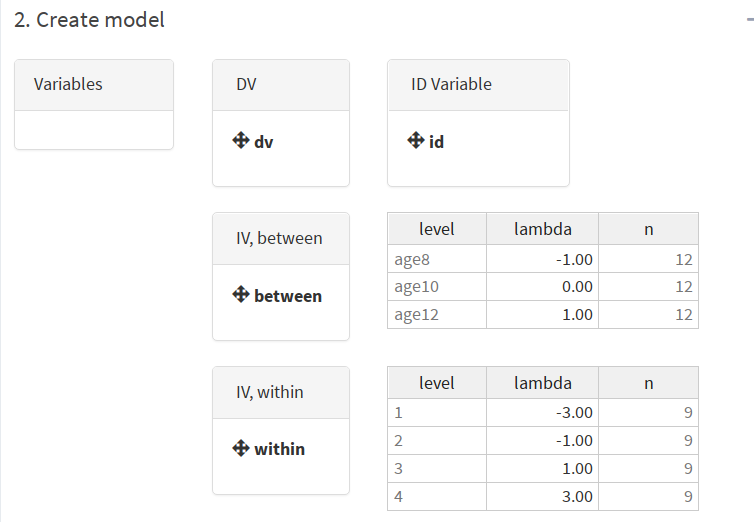
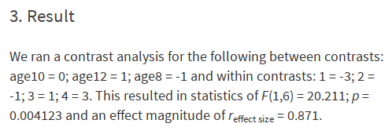

```{r, include = FALSE}
knitr::opts_chunk$set(
  collapse = TRUE,
  comment = "#>"
)

options(width = 80)

library(stringr)

clean_bib <- function(input_file, input_bib, output_bib){
  lines <- paste(readLines(input_file), collapse = "")
  entries <- unique(str_match_all(lines,"@([a-zA-Z0-9]+)[,\\. \\?\\!\\]]")[[1]][, 2])

  bib <- paste(readLines(input_bib), collapse = "\n")
  bib <- unlist(strsplit(bib, "\n@"))

  output <- sapply(entries, grep, bib, value = T)
  output <- paste("@", output, sep = "")

  writeLines(unlist(output), output_bib)
}

#clean_bib("README.Rmd", "library.bib", "clean_library.bib")
#clean_bib("paper/paper.md", "library.bib", "paper/library_paper.bib")
```

[](https://github.com/johannes-titz/cofad/actions/workflows/R-CMD-check.yaml)
[](https://CRAN.R-project.org/package=cofad)
[](https://doi.org/10.21105/joss.03822)

<!-- [](https://doi.org/10.21105/joss.02116) -->

To cite cofad in publications use:

Titz J. & Burkhardt M. (2021). cofad: An R package and shiny app for contrast analysis. Journal of Open Source Software, 6(67), 3822, https://doi.org/10.21105/joss.03822

A BibTeX entry for LaTeX users is

```
@article{titz2021, 
  doi = {10.21105/joss.03822}, 
  url = {https://doi.org/10.21105/joss.03822}, 
  year = {2021}, 
  publisher = {The Open Journal}, 
  volume = {6}, 
  number = {67}, 
  pages = {3822}, 
  author = {Johannes Titz and Markus Burkhardt}, 
  title = {cofad: An R package and shiny app for contrast analysis}, 
  journal = {Journal of Open Source Software} }
```

## Introduction

Cofad is an R package for conducting COntrast analysis in FActorial Designs like ANOVAs. If contrast analysis was to win a price it would be the one for the most underestimated, underused statistical technique. This is unfortunate because in every case a contrast analysis is at least as good as an ANOVA, but in most cases it is better. Contrast analysis gets rid off the unspecific omnibus-hypothesis *there are differences somewhere* and replaces it with a very specific numerical hypothesis. Furthermore, contrast analysis focuses on effects instead of significance. This is expressed doubly: First, there are three different effect sizes for contrast analysis: $r_\mathrm{effectsize}$, $r_\mathrm{contrast}$ and $r_\mathrm{alerting}$. Second, the effect size refers not to the data but to the tested hypothesis. The larger the effect, the more this speaks for the hypothesis. One can even compare different hypotheses against each other (experimentum crucis!) by looking at the effect size for each hypothesis.

Sounds interesting? Then check out some introductory literature such as @furr2004, @rosenthal1985, @rosenthal2000, or, for the German-speaking audience, @sedlmeier2018. Contrast analysis is fairly easy to understand if you know what an ANOVA and a correlation is. In this vignette we assume you are familiar with the basics of contrast analysis and want to apply it to a specific data set. First we show how to install cofad and use the graphical user interface. Then we demonstrate some exemplary analyses for between, within and mixed designs in R.

## Installation

Cofad has two components, the plain R package and a shiny-app that offers an intuitive graphical user interface.

If you just want to use the cofad-app, you do not need to install it. Just go to https://cofad.titz.science and use it there. An example data file is loaded when you go to https://cofad.titz.science/example.

If you prefer the command line interface or want to use the cofad-app locally, install it from github (you need the package devtools for this):

```{r echo = T, results = "hide", eval = F}
# install.packages("devtools") # uncomment if you do not have devtools installed
devtools::install_github("johannes-titz/cofad")
```

Now you can load cofad and use it in your R scripts.

You can also run the app:

```{r echo = T, results = "hide", eval = F}
cofad::run_app()
```

If you have any problems installing cofad, check that your R version is up to date (currently `r version$version.string`). If you are using Windows, enable TLS 1.2 in the Internet Options Advanced tab (see https://github.com/r-lib/remotes/issues/130#issuecomment-423830669). Under Windows, you will also need Rtools to build the package: https://cran.r-project.org/bin/windows/Rtools/.

If it still does not work drop an e-mail at johannes at titz.science or at johannes.titz at gmail.com.

## Using cofad

Before we start: Your data has to be in the long-format (also referred to as narrow or tidy)! If you do not know what this means, please check the short description of the Wikipedia-article: https://en.wikipedia.org/wiki/Wide_and_narrow_data

### Graphical-User-Interface

The graphical-user-interface is self-explanatory. Just load your data and drag the variables to the correct position. At the moment you can only read .sav (SPSS) and .csv files.

As an example go to https://cofad.titz.science/example which will load a data set from @rosenthal2000 (Table 5.3). The cognitive ability of nine children belonging to different age groups (between) was measured four times (within).

There are two hypotheses:

1. cognitive ability linearly increases over time (within)
($\lambda_\mathrm{1} = -3, \lambda_\mathrm{2} = -1, \lambda_\mathrm{3} = 1, \lambda_\mathrm{4} = 3$)
2. cognitive ability linearly increase over age groups (between)
($\lambda_\mathrm{Age 8} = -1, \lambda_\mathrm{Age 10} = 0, \lambda_\mathrm{Age12} = 1$)

Now drag the variables to the correct position and set the lambdas accordingly:



The result should look like this:



A mixed design is ideal for testing out the cofad-app. You can now construct a separate within-model by removing the between variable "age". Then you can construct a separate between-model by removing "time" from within and dragging "age" back into the between panel.

The graphical user interface will suffice for most users, but some will prefer to use the scripting capabilities of R. In the next sections we will look at several script examples for different designs.

### Between-Subjects Designs

Let us first load the package:

```{r setup}
library(cofad)
```

Now we need some data and hypotheses. We can simply take the data from @furr2004, where we have different empathy ratings of students from different majors. This data set is available in the cofad package:

```{r}
data("furr_p4")
furr_p4
```

Furr states three hypotheses:

  - Contrast A: Psychology majors have higher empathy scores than Education majors ($\lambda_\mathrm{psych} = 1, \lambda_\mathrm{edu} = -1$).
  - Contrast B: Business majors have higher empathy scores than Chemistry majors ($\lambda_\mathrm{bus} = 1, \lambda_\mathrm{chem} = -1$).
  - Contrast C: On average, Psychology and Education majors have higher empathy scores than Business and Chemistry majors ($\lambda_\mathrm{psych} = 1, \lambda_\mathrm{edu} = 1, \lambda_\mathrm{bus} = -1, \lambda_\mathrm{chem} = -1$).

These hypotheses are only mean comparisons, but this is a good way to start. Let's use cofad to conduct the contrast analysis:

```{r}
ca <- calc_contrast(dv = empathy, between = major,
                    lambda_between = c("psychology" = 1, "education" = -1,
                                       "business" = 0, "chemistry" = 0),
                    data = furr_p4)
ca
```

The print method shows some basic information that can be directly used in a publication. With the summary method some more details are shown:

```{r}
summary(ca)
```

From this table, $r_\mathrm{effectsize}$ is probably the most useful statistic. It is just the correlation between the lambdas and the dependent variable, which can also be calculated by hand:

```{r}
lambdas <- rep(c(1, -1, 0, 0), each = 5)
cor(furr_p4$empathy, lambdas)
```

The other two hypotheses can be tested accordingly:

```{r}
ca <- calc_contrast(dv = empathy, between = major,
                    lambda_between = c("psychology" = 0, "education" = 0,
                                       "business" = 1, "chemistry" = -1),
                    data = furr_p4)
ca
ca <- calc_contrast(dv = empathy, between = major,
                    lambda_between = c("psychology" = 1, "education" = 1,
                                       "business" = -1, "chemistry" = -1),
                    data = furr_p4)
ca
```

You will find that the numbers are identical to the ones presented in @furr2004. Now, imagine we have a more fun hypothesis and not just mean differences. From an elaborate theory we could derive that the means should be 73, 61, 51 and 38. We can test this with cofad directly because cofad will center the lambdas (the mean of the lambdas has to be 0):

```{r}
ca <- calc_contrast(dv = empathy, between = major,
                    lambda_between = c("psychology" = 73, "education" = 61,
                                       "business" = 51, "chemistry" = 38),
                    data = furr_p4)
ca
```

The manual test gives the same effect size:

```{r}
lambdas <- rep(c(73, 61, 51, 38), each = 5)
cor(furr_p4$empathy, lambdas)
```

Let us now run an analysis for within-subjects designs.

## Within-Subjects Designs

For within designs the calculations are quite different, but cofad takes care of the details. We just have to use the within parameters *within* and *lambda_within* instead of the between equivalents. As an example we use Table 16.5 from @sedlmeier2018. Reading ability was assessed for eight participants under four different conditions. The hypothesis is that you can read best without music, white noise reduces your reading ability and music (independent of type) reduces it even further.

```{r}
data("sedlmeier_p537")
head(sedlmeier_p537)
calc_contrast(dv = reading_test, within = music,
              lambda_within = c("without music" = 1.25, 
                                "white noise" = 0.25,
                                "classic" = -0.75,
                                "jazz" = -0.75),
              id = participant, data = sedlmeier_p537)
```

You can see that the significance test is just a $t$-test and the reported effect size is referring to a mean comparison ($g$). (The $t$-test is one-tailed, because contrast analysis has always a specific hypotheses.) When conducting the analysis by hand, we can see why:

```{r}
mtr <- matrix(sedlmeier_p537$reading_test, ncol = 4)
lambdas <- c(1.25, 0.25, -0.75, -0.75)
lc1 <- mtr %*% lambdas
t.test(lc1)
```

Only the linear combination of the dependent variable and the contrast weights for each participant is needed. With these values a normal $t$-test against 0 is conducted. While you can do this manually, using cofad is quicker and it also gives you more information such as the different effect sizes.

## Mixed Designs

A mixed design combines between and within factors. In this case cofad first calculates the linear combination (*L*-Values) for the within factor. This new variable serves as the dependent variable for a between contrast analysis. We will again look at the example presented in @rosenthal2000 (see the section graphical user interface). The cognitive ability of nine children belonging to different age groups (between) was measured four times (within).

There are two hypotheses:

1. cognitive ability linearly increases over time (within)
($\lambda_\mathrm{1} = -3, \lambda_\mathrm{2} = -1, \lambda_\mathrm{3} = 1, \lambda_\mathrm{4} = 3$)
2. cognitive ability linearly increase over age groups (between)
($\lambda_\mathrm{Age 8} = -1, \lambda_\mathrm{Age 10} = 0, \lambda_\mathrm{Age12} = 1$)

Let's have a look at the data and calculation:

```{r}
data("rosenthal_tbl53")
head(rosenthal_tbl53)
lambda_within <- c("1" = -3, "2" = -1, "3" = 1, "4" = 3)
lambda_between <-c("age8" = -1, "age10" = 0, "age12" = 1)

contr_mx <- calc_contrast(dv = dv, 
                          between = between,
                          lambda_between = lambda_between,
                          within = within,
                          lambda_within = lambda_within,
                          id = id, 
                          data = rosenthal_tbl53)
contr_mx
```

The results look like a contrast analysis for between-subject designs. The summary gives some more details: The effect sizes, within group means and standard errors of the *L*-values.

```{r}
summary(contr_mx)
```

## Comparing two hypotheses

With `cofad` you can also compare two competing hypotheses. As an example @sedlmeier2013 use a fictitious data set on problem solving skills of boys:

```{r}
sedlmeier_p525
```

Where lsg is the number of solved exercises and the groups are KT = no training, JT = boys-specific training, MT=girls-specific training. Two hypotheses are competing:

- -2, 3, -1 (boys benefit from boys-specific training)
- -2, 1, 1 (boys benefit from training, independent of the type of training)

First, we need to create the difference lambdas:

```{r}
lambda1 <- c(-2, 3, -1)
lambda2 <- c(-2, 1, 1)
lambda_diff <- lambda_diff(lambda1, lambda2, labels = c("KT", "JT", "MT"))
lambda_diff
```

Note that you cannot just subtract the lambdas because their variance can differ, which has an effect on the test. Instead, you need to standardize the lambdas first. `lambda_diff` takes care of this for you.

Now you can run a normal contrast analysis:

```{r}
ca_competing <- calc_contrast(
  dv = lsg,
  between = between,
  lambda_between = round(lambda_diff, 2),
  data = sedlmeier_p525
)
summary(ca_competing)
ca_competing
```
Here, we rounded the lambdas so that the result is similar to the one in @sedlmeier2013, who found t=1.137 and r_effectsize=0.26. The effet size is the same, but what about the t-value? Well, we need to take the root of the F-value, 1.291, which is `r round(sqrt(1.291), 3)`. There is still a slight difference to the original result of 1.137, which is likely due to rounding errors.

The same also works for within-designs. The reading comprehension data from above can serve as an example. Reading ability was assessed for eight participants under four different conditions:

```{r}
sedlmeier_p537
```

There are two hypotheses:

- 1.25, 0.25, -0.75, -0.75: You can read best without music, white noise reduces your reading ability and music (independent of type) reduces it even further.
- 3, -1, -1, -1: Noise of any kind reduces reading ability.

Again, we need to calculate the difference lambdas first:

```{r}
lambda1 <- c(1.25, 0.25, -0.75, -0.75)
lambda2 <- c(3, -1, -1, -1)
lambda_diff <- lambda_diff(lambda2, lambda1,
                           labels = c("without music", "white noise", "classic",
                                      "jazz"))
lambda_diff
```

Note that we use lambda2 as the first entry into `lambda_diff` because this is how @sedlmeier2013 calculated it (hypothesis2-hypothesis1).

And now the contrast analysis:

```{r}
contr_wi <- calc_contrast(
  dv = reading_test, within = music,
  lambda_within = round(lambda_diff, 2),
  id = participant, data = sedlmeier_p537
)
summary(contr_wi)
contr_wi
```

@sedlmeier2013 found a t-value of -3.75 and a g_contrast of -1.33. Again, there are slight differences to our calculation, likely due to rounding errors. Further note, that hypothesis 1 fits better, because the statistic and effect are negative.

## Aggregated Data

Sometimes you would like to run a contrast analysis on aggregated data (e.g. when no raw data is available). If you have the means, standard deviations and sample sizes for every condition, you can do this with cofad. For instance, if we take our first example and aggregate it, we can still calculate the contrast analysis:

```{r message=FALSE}
library(dplyr)
furr_agg <- furr_p4 %>% 
  group_by(major) %>% 
  summarize(mean = mean(empathy), sd = sd(empathy), n = n())
lambdas = c("psychology" = 1, "education" = -1, "business" = 0, "chemistry" = 0)
calc_contrast_aggregated(mean, sd, n, major, lambdas, furr_agg)
```

And the result is indeed the same when compared to the analysis with the raw data:

```{r}
ca <- calc_contrast(dv = empathy, between = major,
                    lambda_between = c("psychology" = 1, "education" = -1,
                                       "business" = 0, "chemistry" = 0),
                    data = furr_p4)
ca
```

Note that this will only work for between-subjects designs.

## Issues and Support

If you find any bugs, please use the issue tracker at:

https://github.com/johannes-titz/cofad/issues

If you need answers on how to use the package, drop an e-mail at johannes at titz.science or johannes.titz at gmail.com

## Contributing

Comments and feedback of any kind are very welcome! We will thoroughly consider every suggestion on how to improve the code, the documentation, and the presented examples. Even minor things, such as suggestions for better wording or improving grammar in any part of the package, are more than welcome.

If you want to make a pull request, please check that you can still build the package without any errors, warnings, or notes. Overall, simply stick to the R packages book: https://r-pkgs.org/ and follow the code style described here: http://r-pkgs.had.co.nz/r.html#style

## Acknowledgments

We want to thank Thomas Schäfer and Isabell Winkler for testing cofad and giving helpful feedback.

## References
