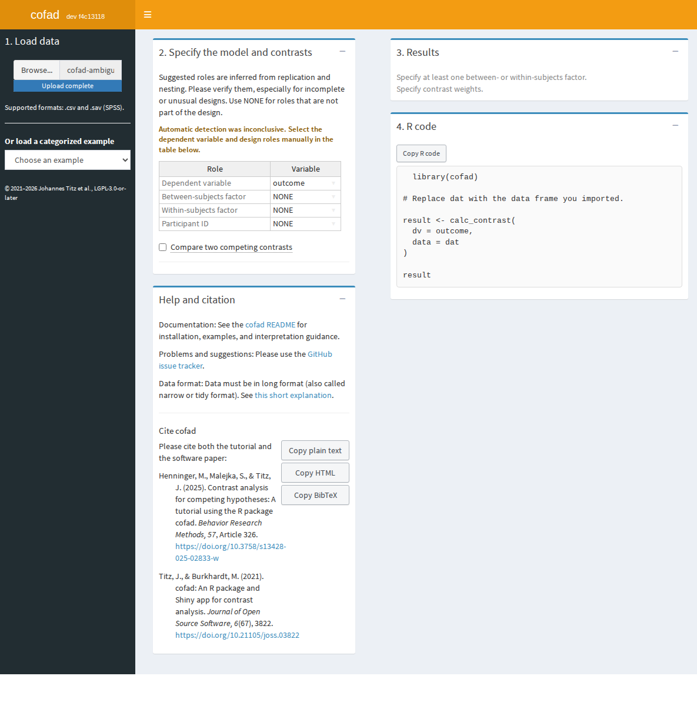

```{r, include = FALSE}
knitr::opts_chunk$set(
  collapse = TRUE,
  comment = "#>"
)

options(width = 80)

# library(stringr)
# 
# clean_bib <- function(input_file, input_bib, output_bib){
#   lines <- paste(readLines(input_file), collapse = "")
#   entries <- unique(str_match_all(lines,"@([a-zA-Z0-9]+)[,\\. \\?\\!\\]]")[[1]][, 2])
# 
#   bib <- paste(readLines(input_bib), collapse = "\n")
#   bib <- unlist(strsplit(bib, "\n@"))
# 
#   output <- sapply(entries, grep, bib, value = T)
#   output <- paste("@", output, sep = "")
# 
#   writeLines(unlist(output), output_bib)
# }

#clean_bib("README.Rmd", "library.bib", "clean_library.bib")
#clean_bib("paper/paper.md", "library.bib", "paper/library_paper.bib")
```

# 

[](https://github.com/johannes-titz/cofad/actions/workflows/R-CMD-check.yaml)
[](https://github.com/johannes-titz/cofad/actions/workflows/test-coverage.yaml)
[](https://app.codecov.io/gh/johannes-titz/cofad)
[](https://johannes-titz.github.io/cofad/)
[](https://CRAN.R-project.org/package=cofad)
[](https://doi.org/10.21105/joss.03822)

<!-- [](https://doi.org/10.21105/joss.02116) -->

## Contents

- [Citation](#citation)
- [Introduction](#introduction)
- [Installation](#installation)
  - [Docker](#docker)
- [Using cofad](#using-cofad)
  - [Graphical user interface](#graphical-user-interface)
  - [Between-subjects designs](#between-subjects-designs)
  - [Within-subjects designs](#within-subjects-designs)
    - [Using participant L or r scores](#using-participant-l-or-r-scores)
  - [Mixed designs](#mixed-designs)
- [Comparing two hypotheses](#comparing-two-hypotheses)
- [Aggregated data](#aggregated-data)
- [Testing](#testing)
- [Browser-only webR version](#browser-only-webr-version)
- [Issues and support](#issues-and-support)
- [Contributing](#contributing)
- [Acknowledgments](#acknowledgments)
- [References](#references)

## Citation

If you use `cofad` and find it useful, please cite both the current tutorial and the software paper:

<div class="csl-bib-body">
  <div class="csl-entry">Henninger, M., Malejka, S., &amp; Titz, J. (2025). Contrast analysis for competing hypotheses: A tutorial using the R package cofad. <i>Behavior Research Methods, 57</i>, Article 326. <a href="https://doi.org/10.3758/s13428-025-02833-w">https://doi.org/10.3758/s13428-025-02833-w</a></div>
  <div class="csl-entry">Titz, J., &amp; Burkhardt, M. (2021). cofad: An R package and Shiny app for contrast analysis. <i>Journal of Open Source Software, 6</i>(67), 3822. <a href="https://doi.org/10.21105/joss.03822">https://doi.org/10.21105/joss.03822</a></div>
</div>

<details>
<summary>Copy BibTeX</summary>

```bibtex
@article{henninger2025cofad,
  author = {Henninger, Mirka and Malejka, Simone and Titz, Johannes},
  title = {Contrast analysis for competing hypotheses: A tutorial using the {R} package cofad},
  journal = {Behavior Research Methods},
  year = {2025},
  volume = {57},
  pages = {326},
  doi = {10.3758/s13428-025-02833-w}
}

@article{titz2021cofad,
  author = {Titz, Johannes and Burkhardt, Markus},
  title = {cofad: An {R} package and {Shiny} app for contrast analysis},
  journal = {Journal of Open Source Software},
  year = {2021},
  volume = {6},
  number = {67},
  pages = {3822},
  doi = {10.21105/joss.03822}
}
```

</details>

## Introduction

Cofad is an R package for conducting COntrast analysis in FActorial Designs. If contrast analysis were to win an award, it might be for the most underestimated and underused statistical technique. This is unfortunate, because contrast analysis is at least as informative as ANOVA—and often considerably more so. Instead of testing an unspecific omnibus hypothesis such as “there are differences somewhere,” contrast analysis allows you to formulate and test precise, numerically specified hypotheses about the effects of interest. In doing so, it shifts the emphasis from merely asking whether an effect exists to evaluating its expected pattern and magnitude.

This focus on effects is reflected in two key ways:

1. Between-subjects and mixed analyses provide three distinct effect-size measures: $r_\mathrm{es}$, $r_\mathrm{contrast}$, and $r_\mathrm{alerting}$. Pure within-subjects analyses instead report $r_\mathrm{contrast}$ and $g_\mathrm{contrast}$, because the other two measures rely on a between-group partition.
2. These effect sizes capture different aspects of how closely the observed data conform to the specified contrast.

Cofad also allows you to compare two competing hypotheses directly (*experimentum crucis*) by constructing a difference contrast.

Sounds interesting? Then take a look at some introductory literature, such as @henninger2025, @furr2004, @rosenthal1985, @rosenthal2000, or---for German-speaking readers---@sedlmeier2018. Contrast analysis is relatively easy to grasp if you are already familiar with ANOVA and correlation.

In this vignette, we assume a basic understanding of contrast analysis and focus on its practical application to a specific dataset. We first show how to install cofad and use its graphical user interface. We then work through several example analyses for between-subjects, within-subjects, and mixed designs in R.

## Installation

Cofad has two components: the R package and a Shiny app that provides a graphical user interface.

If you only want to use the cofad app, no installation is required. Simply go to [https://cofad.titz.science](https://cofad.titz.science), where you can select from categorized example datasets or upload your own data. A webR version is also available at [https://johannes-titz.github.io/cofad/](https://johannes-titz.github.io/cofad/).

If you prefer the command-line interface or want to run the cofad app locally, install the package from CRAN:

```{r message=FALSE, eval=F}
install.packages("cofad")
```

Alternatively, you can install the development version from GitHub (you need the `remotes` package for this):

```{r echo = T, results = "hide", eval = F}
# install.packages("remotes") # uncomment if you do not have remotes installed
remotes::install_github("johannes-titz/cofad")
```

Now you can load cofad and use it directly in your R scripts.

You can also launch the app locally:

```{r echo = T, results = "hide", eval = F}
cofad::run_app()
```

### Docker

To run the server-backed app in a container, build the included `Dockerfile`
from the repository root and publish its port:

```bash
docker build -t cofad .
docker run --rm -p 3838:3838 cofad
```

Then open <http://localhost:3838>. The image uses R 4.6.1, runs the app as a
non-root user, and includes a container health check. To use another available
Rocker Shiny version, override the build argument, for example
`docker build --build-arg R_VERSION=4.5.3 -t cofad .`.

<!-- If you have any problems installing cofad, check that your R version is up to date (currently `r version$version.string`). If you are using Windows, enable TLS 1.2 in the Internet Options Advanced tab (see https://github.com/r-lib/remotes/issues/130#issuecomment-423830669). Under Windows, you will also need Rtools to build the package: https://cran.r-project.org/bin/windows/Rtools/. -->

<!-- If it still does not work drop an e-mail at johannes at titz.science or at johannes.titz at gmail.com. -->

## Using cofad

Before you start, your data must be in long format (also called narrow or tidy format). If you are unfamiliar with this format, see the short explanation in the Wikipedia article: [https://en.wikipedia.org/wiki/Wide_and_narrow_data](https://en.wikipedia.org/wiki/Wide_and_narrow_data).

### Graphical user interface

Load a `.csv` or `.sav` (SPSS) file, or select a packaged example grouped as
between, within, or mixed. At startup, both the server-backed and browser-only
webR interfaces load Rosenthal et al.'s Table 5.3 mixed-design example with its
linear between- and within-subjects contrasts.

cofad automatically examines replication and nesting to
suggest the dependent variable, between-subjects factor, within-subjects factor,
and participant ID. Every suggestion remains editable in the model table. The
detector is deliberately conservative: it cannot infer the scientific meaning
of variables or the intended hypothesis from correlations alone. Packaged
examples therefore use the roles and planned weights documented in their books
or papers, while still displaying the structural-detection result.

[](https://cofad.titz.science)

If detection is inconclusive or cannot run, the app does not force a structure.
It retains a suggested dependent variable where possible, leaves uncertain
roles as `NONE`, and asks you to choose the design manually in the same table.
This fallback is available for between-, within-, and mixed-subjects designs.



You can inspect the automatic suggestion from R with
`detect_design(your_data)`. It reports structural diagnostics and a confidence
score, but its result should always be checked against the documented study
design. In the app, manual role selection remains available regardless of the
confidence score.

Between- and within-subjects contrast tables are activated automatically from
the roles selected in the model table. For a mixed design, choose whether to
test the **Between × within contrast** or the **Within contrast averaged across
groups**. New mixed designs default to the former, as in Rosenthal et al.'s
Table 5.3; packaged examples retain the analysis used by their source.

The default example comes from @rosenthal2000 (Table 5.3). The cognitive ability
of nine children belonging to different age groups (between) was measured four
times (within).

There are two hypotheses:

1. cognitive ability linearly increases over time (within)
($\lambda_\mathrm{1} = -3, \lambda_\mathrm{2} = -1, \lambda_\mathrm{3} = 1, \lambda_\mathrm{4} = 3$)
2. cognitive ability linearly increases over age groups (between)
($\lambda_\mathrm{Age 8} = -1, \lambda_\mathrm{Age 10} = 0, \lambda_\mathrm{Age12} = 1$)

Select the variables in the compact model table and edit the default contrast weights in the lambda tables. The app reports the contrast, a detailed variance decomposition with ordinary $\eta^2$ for each SS component (including the descriptive within-group/error share) and partial eta squared for tested components, plus an interactive Plotly chart comparing total, between-group, and contrast-plus-error denominators. Its legend labels Contrast, Other between-group, and Within-group/error above the bars. Hovering over a segment shows its SS numerator and denominator. Small *p* values are shown numerically in scientific notation rather than as threshold statements. For mixed designs, this is explicitly a partition of participants' derived within-contrast scores, not of the raw repeated outcome variance. The paper-ready report is copyable, while the F table can be exported as aligned plain text, rich HTML, or DOCX; numeric table columns are right-aligned. The Help and citation panel beneath the model contains the package references, README, and GitHub issue tracker.

A mixed design is ideal for trying the cofad app. You can construct a separate within-subjects model by setting the between-subjects factor to `NONE`. Likewise, set the within-subjects factor and participant ID to `NONE` to obtain a between-subjects model.

To compare two competing contrasts, select **Compare two competing
contrasts**. Each active weight table then shows **Favored** and **Rival**
columns. Cofad standardizes both vectors before analyzing Favored minus Rival,
as `lambda_diff()` does. Initially, Rival reverses Favored, preserving the
current test until you edit the rival hypothesis. Clearing the checkbox removes
the Rival columns and immediately restores the Favored weights as ordinary
single contrasts.

The graphical user interface will suffice for many users, but some will prefer to use the scripting capabilities of R. In the next sections we will look at several script examples for different designs.

### Between-Subjects Designs

First, load the package:

```{r setup}
library(cofad)
```

Now we need some data and hypotheses. We use the data from @furr2004, which contain empathy ratings of students from different majors. The dataset is included in the cofad package:

```{r}
data("furr_p4")
furr_p4
```

Furr proposes three hypotheses:

* Contrast A: Psychology majors have higher empathy scores than Education majors ($\lambda_\mathrm{psych} = 1, \lambda_\mathrm{edu} = -1$).
* Contrast B: Business majors have higher empathy scores than Chemistry majors ($\lambda_\mathrm{bus} = 1, \lambda_\mathrm{chem} = -1$).
* Contrast C: On average, Psychology and Education majors have higher empathy scores than Business and Chemistry majors ($\lambda_\mathrm{psych} = 1, \lambda_\mathrm{edu} = 1, \lambda_\mathrm{bus} = -1, \lambda_\mathrm{chem} = -1$).

These hypotheses involve simple mean comparisons, making them a good starting point. Let us use cofad to conduct the contrast analysis:

```{r}
ca <- calc_contrast(dv = empathy, between = major,
                    lambda_between = c("psychology" = 1, "education" = -1,
                                       "business" = 0, "chemistry" = 0),
                    data = furr_p4)
ca
```

The print method provides basic information that can be used directly in a publication. The summary method provides additional details:

```{r}
summary(ca)
```

From this table, $r_\mathrm{effectsize}$ is probably the most useful statistic. It is simply the correlation between the contrast weights ($\lambda$) and the dependent variable, which can also be calculated by hand:

```{r}
lambdas <- rep(c(1, -1, 0, 0), each = 5)
cor(furr_p4$empathy, lambdas)
```

As you can see, the effect is negative, and `cofad` also warns that the observed contrast runs in the opposite direction to the hypothesis. This constitutes a clear failure of the hypothesis and points to substantial problems with the underlying theory.

The other two hypotheses can be tested in the same way.

```{r}
ca <- calc_contrast(dv = empathy, between = major,
                    lambda_between = c("psychology" = 0, "education" = 0,
                                       "business" = 1, "chemistry" = -1),
                    data = furr_p4)
ca
ca <- calc_contrast(dv = empathy, between = major,
                    lambda_between = c("psychology" = 1, "education" = 1,
                                       "business" = -1, "chemistry" = -1),
                    data = furr_p4)
ca
```

When you compare these results with those reported in @furr2004, you will find the same pattern. Note that a one-sided test is appropriate because the direction of the contrast is specified in advance. A contrast hypothesis should not be treated as interchangeable with its reverse direction. The *F* test itself is non-directional; for a single contrast, the corresponding directional test uses the signed *t* statistic, with $|t| = \sqrt{F}$.

Now, imagine a more interesting hypothesis that goes beyond simple mean differences. Suppose an elaborate theory predicts means of 73, 61, 51, and 38 for the four groups. We can test this pattern directly with `cofad`, because the package automatically centers the contrast weights so that their mean is zero:

```{r}
ca <- calc_contrast(dv = empathy, between = major,
                    lambda_between = c("psychology" = 73, "education" = 61,
                                       "business" = 51, "chemistry" = 38),
                    data = furr_p4)
ca
```

The manual calculation yields the same effect size:

```{r}
lambdas <- rep(c(73, 61, 51, 38), each = 5)
cor(furr_p4$empathy, lambdas)
```

Let us now turn to contrast analysis for within-subjects designs.

### Within-Subjects Designs

For within-subjects designs, the calculations differ substantially, but `cofad` takes care of the details. We only need to use the within-subject parameters *within* and *lambda_within* instead of their between-subjects counterparts. As an example, we use Table 16.5 from @sedlmeier2018, in which reading ability was assessed for eight participants under four different conditions. The hypothesis is that reading performance is best without music, lower under white noise, and lowest with music, regardless of the type of music.

```{r}
data("sedlmeier_p537")
head(sedlmeier_p537)
within <- calc_contrast(dv = reading_test, within = music,
                        lambda_within = c("without music" = 1.25, 
                                          "white noise" = 0.25,
                                          "classic" = -0.75,
                                          "jazz" = -0.75),
                        id = participant, data = sedlmeier_p537)
summary(within)
within
```

As you can see, the significance test is a one-tailed $t$-test, and the paper-ready report provides the signed effect-size correlation $r_\mathrm{contrast}$.

For this within-subjects contrast, $r_\mathrm{contrast}$ is the signed
correlation-form effect derived from the same test,
$r_\mathrm{contrast} = \operatorname{sign}(t)\sqrt{t^2/(t^2 + df_\mathrm{error})}$.
Consequently, $r_\mathrm{contrast}^2$ equals the contrast-specific
$\eta^2$ and partial $\eta_p^2$. The between-design
$r_\mathrm{es}$ and $r_\mathrm{alerting}$ are not defined by this pure
within-subjects contrast partition.

We can verify the result by hand relatively easily:
```{r}
mtr <- matrix(sedlmeier_p537$reading_test, ncol = 4)
lambdas <- c(1.25, 0.25, -0.75, -0.75)
lc1 <- mtr %*% lambdas
t.test(lc1, alternative = "greater")
```

All that is needed is the linear combination of the dependent variable and the contrast weights for each participant. These values are then tested against zero using a standard $t$-test. Although this can be done manually, `cofad` is faster and provides additional information.

#### Using participant L or r scores

For a within contrast, `within_score = "L"` (the default) calculates each
participant's weighted sum. It retains the absolute magnitude of the response,
so choose L when the size of a predicted increase or decrease is substantively
meaningful. `within_score = "r"` instead correlates each participant's response
profile with the contrast weights. It measures pattern agreement and is
unchanged by adding a constant or multiplying a profile by a positive constant.
Choose r when adherence to the predicted shape matters more than amplitude,
especially when there are many repeated conditions.

The choice should follow the research question and be made before comparing the
results. With only two repeated levels, a defined r score can only be -1 or 1
and discards magnitude; L is usually more informative. An r score is undefined
for a participant whose responses are all equal, and cofad reports those IDs.

Rosenthal et al.'s Table 5.4 makes the distinction concrete. Child A has the
larger weighted sum but Child B follows the linear pattern perfectly:

```{r}
data("rosenthal_tbl54")
weights <- c("1" = -3, "2" = -1, "3" = 1, "4" = 3)

calc_contrast(dv, within = within, lambda_within = weights, id = id,
              data = rosenthal_tbl54, within_score = "L")$participant_scores
calc_contrast(dv, within = within, lambda_within = weights, id = id,
              data = rosenthal_tbl54, within_score = "r")$participant_scores
```

For a complete within-subjects analysis based on participant correlations,
change only `within_score`:

```{r}
within_r <- calc_contrast(
  dv = reading_test,
  within = music,
  lambda_within = c(
    "without music" = 1.25,
    "white noise" = 0.25,
    "classic" = -0.75,
    "jazz" = -0.75
  ),
  id = participant,
  data = sedlmeier_p537,
  within_score = "r"
)
summary(within_r)
```

The app exposes the same choice as **Participant-level within score**, with
labels that distinguish magnitude (L) from pattern fit (r).

### Mixed Designs

A mixed design combines between- and within-subjects factors. Cofad first
calculates one participant-level score for the within contrast: a weighted sum
(*L*) by default or a profile correlation (*r*) when `within_score = "r"`.
That score becomes the dependent variable for the between-subjects contrast.

We will again use the example from @rosenthal2000 (see the graphical-user-interface section). The cognitive ability of nine children from three different age groups (between-subjects factor) was measured at four time points (within-subjects factor).

There are two hypotheses:

1. Cognitive ability increases linearly over time (within subjects):
   ($\lambda_\mathrm{1} = -3, \lambda_\mathrm{2} = -1, \lambda_\mathrm{3} = 1, \lambda_\mathrm{4} = 3$).
2. Cognitive ability increases linearly across age groups (between subjects):
   ($\lambda_\mathrm{Age 8} = -1, \lambda_\mathrm{Age 10} = 0, \lambda_\mathrm{Age 12} = 1$).

Let us have a look at the data and the corresponding calculations:

```{r}
data("rosenthal_tbl53")
head(rosenthal_tbl53)
lambda_within <- c("1" = -3, "2" = -1, "3" = 1, "4" = 3)
lambda_between <-c("age8" = -1, "age10" = 0, "age12" = 1)

contr_mx <- calc_contrast(dv = dv, 
                          between = between,
                          lambda_between = lambda_between,
                          within = within,
                          lambda_within = lambda_within,
                          id = id, 
                          data = rosenthal_tbl53)
contr_mx
```

The results resemble those from a between-subjects contrast analysis. The summary additionally reports the effect sizes, along with the between-group means and standard errors of the selected participant-level score.

```{r}
summary(contr_mx)
```

To test pattern fit rather than response magnitude, use the same model with
`within_score = "r"`. The returned `participant_scores` retain the unrounded
correlations. Rosenthal et al. printed these values to two decimals before their
worked calculation, so calculations from the raw data differ slightly from the
book's rounded F value.

```{r}
contr_mx_r <- calc_contrast(
  dv = dv, between = between, lambda_between = lambda_between,
  within = within, lambda_within = lambda_within, id = id,
  data = rosenthal_tbl53, within_score = "r"
)
contr_mx_r$participant_scores
```

## Comparing two hypotheses

With `cofad`, you can also compare two competing hypotheses directly. A useful introduction to this logic is provided by @henninger2025. As an example, @sedlmeier2013 use a fictitious data set on the problem-solving skills of boys:

```{r}
sedlmeier_p525
```

Here, `lsg` is the number of solved exercises, and the groups are KT = no training, JT = boys-specific training, and MT = girls-specific training. Two hypotheses are competing:

- -2, 3, -1 (boys benefit from boys-specific training)
- -2, 1, 1 (boys benefit from training, independently of the type of training)

First, we need to create the difference lambdas:

```{r}
lambda1 <- c(-2, 3, -1)
lambda2 <- c(-2, 1, 1)
lambda <- lambda_diff(lambda1, lambda2, labels = c("KT", "JT", "MT"))
lambda
```

Note that you cannot simply subtract the contrast weights, because the two sets of weights may differ in variance, which affects the comparison. Instead, the weights must first be standardized. `lambda_diff` takes care of this automatically.

Now you can run a standard contrast analysis:

```{r}
ca_competing <- calc_contrast(
  dv = lsg,
  between = between,
  lambda_between = round(lambda, 2),
  data = sedlmeier_p525
)
summary(ca_competing)
ca_competing
```

Here, we rounded the contrast weights so that the results closely match those reported in @sedlmeier2013, who found $t = 1.137$ and $r_\mathrm{effectsize} = 0.26$. The effect size is identical. For the $t4 statistic, we take the signed square root of the $F$ value, 1.291, which gives `r round(sqrt(1.291), 3)`. The remaining difference from the reported value of 1.137 is due to rounding.

The same approach also works for within-subjects designs. We can use the reading-comprehension data from above as an example, in which reading ability was assessed for eight participants under four different conditions:

```{r}
sedlmeier_p537
```

There are two competing hypotheses:

- $1.25, 0.25, -0.75, -0.75$: Reading performance is highest without music, lower with white noise, and lowest with music, regardless of music type.
- $3, -1, -1, -1$: Any kind of noise reduces reading performance to the same extent.

Again, we first need to calculate the difference contrast weights:

```{r}
lambda1 <- c(1.25, 0.25, -0.75, -0.75)
lambda2 <- c(3, -1, -1, -1)
lambda <- lambda_diff(lambda2, lambda1,
                      labels = c("without music", "white noise", "classic",
                                 "jazz"))
lambda
```

Note that we use `lambda2` as the first argument to `lambda_diff`, because this follows the calculation in @sedlmeier2013, where the difference is defined as hypothesis 2 minus hypothesis 1.

Now we can run the contrast analysis:

```{r}
contr_wi <- calc_contrast(
  dv = reading_test,
  within = music,
  lambda_within = round(lambda, 2),
  id = participant,
  data = sedlmeier_p537
)
summary(contr_wi)
contr_wi
```

@sedlmeier2013 reported a $t$ value of $-3.75$ and a $g_\mathrm{contrast}$ of $-1.33$. Again, the slight difference in the $t$ value compared with our calculation is due to rounding. Because the difference contrast was defined as hypothesis 2 minus hypothesis 1, the negative test statistic and effect size indicate that hypothesis 1 provides the better fit.

## Aggregated Data

Sometimes, you may want to run a contrast analysis on aggregated data, for example when the raw data are unavailable. If you have the means, standard deviations, and sample sizes for each condition, you can still perform the analysis with `cofad`. For instance, if we aggregate the data from our first example, we can reproduce the contrast analysis from the summary statistics alone:

```{r message=FALSE}
furr_agg <- aggregate(
  empathy ~ major, furr_p4,
  function(x) c(mean = mean(x), sd = sd(x), n = length(x))
)
furr_agg <- data.frame(
  major = furr_agg$major,
  mean = furr_agg$empathy[, "mean"],
  sd = furr_agg$empathy[, "sd"],
  n = furr_agg$empathy[, "n"]
)
lambdas = c("psychology" = 1, "education" = -1, "business" = 0, "chemistry" = 0)
calc_contrast_aggregated(mean, sd, n, major, lambdas, furr_agg)
```

And indeed, the result is identical to that obtained from the raw data:

```{r}
ca <- calc_contrast(dv = empathy, between = major,
                    lambda_between = c("psychology" = 1, "education" = -1,
                                       "business" = 0, "chemistry" = 0),
                    data = furr_p4)
ca
```

Note that this approach is limited to between-subjects designs.

## Testing

The test suite includes unit, regression, example, summary-method, validation,
in-process Shiny server, and browser integration tests. GitHub Actions runs both
R CMD check and an in-process coverage workflow on every push and pull request.
The server tests use `shiny::testServer()`, so
`covr::package_coverage(type = "tests")` measures app logic without starting a
browser process. Browser
tests remain a thinner end-to-end layer and are skipped on CRAN and continuous
integration because their timing has been unreliable on some runners.

## Browser-only webR version

A static Shinylive build can run cofad entirely in the browser through webR, without a Shiny server. It is published to <https://johannes-titz.github.io/cofad/> by the `deploy-shinylive` GitHub Actions workflow on every push to the main branch.

For a local build, run `source("tools/build-shinylive.R")` from the repository root; the generated `docs/` directory can be served by any static web host. The current static artifact is approximately 65 MiB. In a local Chromium benchmark on August 15, 2026, a fresh isolated browser context showed the controls after 26.9 seconds and a selected example's model table after 32.9 seconds. A cached reload took 22.4 and 26.8 seconds, respectively. These are single-machine localhost measurements, not network guarantees. The server-backed app remains preferable when the lowest latency matters.

## Issues and Support

If you find any bugs, please use the issue tracker at:

https://github.com/johannes-titz/cofad/issues

If you need answers on how to use the package, drop an e-mail at johannes at titz.science or johannes.titz at gmail.com

## Contributing

Comments and feedback of any kind are very welcome! We carefully consider every suggestion for improving the code, documentation, and examples. Even small contributions, such as clearer wording or grammar corrections, are greatly appreciated.

If you would like to submit a pull request, please make sure that the package still builds without errors, warnings, or notes. In general, follow the recommendations in the R Packages book: [https://r-pkgs.org/](https://r-pkgs.org/) and the tidyverse style guide: [https://style.tidyverse.org/](https://style.tidyverse.org/).

## Acknowledgments

We would like to thank Thomas Schäfer and Isabell Winkler for testing `cofad` and providing valuable feedback.

## References
